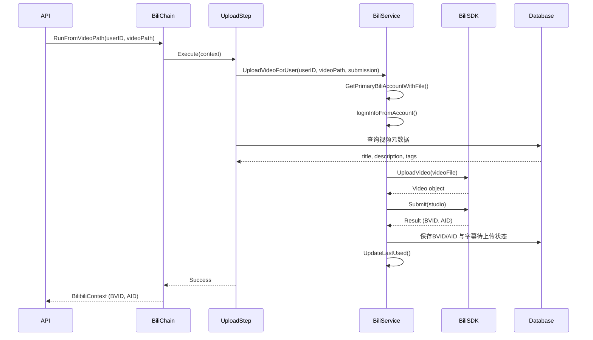

# B站上传工作流使用指南

## 概述

本项目新增了独立的**B站上传工作流** (`BilibiliWorkflow`)，与原有的 YouTube 工作流完全分离。可以灵活地将已下载的视频上传到B站，支持多账号管理。

## 架构设计

### 工作流分离

```
YouTube Workflow (原有)          Bilibili Workflow (新增)
├── InitStep                     └── UploadToBilibiliStep
├── DownloadVideoStep                 - 获取用户主B站账号
├── DownloadThumbnailStep             - 解密登录凭证
├── ExtractAudioStep                  - 上传视频到B站
├── TranscribeStep                    - 提交稿件
├── TranslateStep                     - 保存结果
└── SaveDatabaseStep
```

### 模块化设计

- **YouTubeWorkflowModule**: 处理视频下载、转录、翻译等
- **BilibiliWorkflowModule**: 独立处理B站上传

## 核心组件

### 1. UploadToBilibiliStep

上传视频到B站的步骤实现，主要功能：

- 自动获取用户的主B站账号
- 解密存储的登录凭证和令牌
- 上传视频文件到B站
- 构建并提交稿件信息
- 保存 BVID/AID 到数据库
- 更新账号最后使用时间

**特性**:
- ✅ 支持多账号管理（自动选择主账号）
- ✅ 加密凭证安全存储
- ✅ 智能错误处理和友好提示
- ✅ 标题清理（移除hashtag）
- ✅ 描述长度限制（2000字）
- ✅ 自动添加原视频链接

### 2. BilibiliChain

B站上传任务链，提供两种使用方式：

#### 方式一：完整上下文
```go
ctx := &BilibiliContext{
    VideoContext: VideoContext{
        VideoPath: "/path/to/video.mp4",
        VideoURL:  "https://youtube.com/watch?v=xxx",
        VideoID:   "video_id",
    },
    UserID: "user_firebase_id",
}

err := bilibiliChain.Run(context.Background(), ctx)
```

#### 方式二：简化接口
```go
ctx, err := bilibiliChain.RunFromVideoPath(
    context.Background(),
    "user_firebase_id",
    "/path/to/video.mp4",
    "https://youtube.com/watch?v=xxx",
)
```

## 使用方法

### 前置条件

1. **绑定B站账号**: 用户需要先通过二维码登录绑定B站账号
2. **设置主账号**: 如果有多个账号，需要设置一个主账号用于上传
3. **视频文件**: 已下载的视频文件（支持 .mp4, .flv, .mkv, .webm, .avi, .mov）

### 集成步骤

#### 1. 引入模块

在 `main.go` 或 `bootstrap.go` 中添加：

```go
import "github.com/difyz9/ytb2bili/internal/workflow"

fx.New(
    // ... 其他模块
    workflow.YouTubeWorkflowModule,  // YouTube 工作流（原有）
    workflow.BilibiliWorkflowModule, // B站上传工作流（新增）
    // ...
)
```

#### 2. 注入使用

```go
type Handler struct {
    biliChain *workflow.BilibiliChain
    logger    *zap.Logger
}

func NewHandler(biliChain *workflow.BilibiliChain, logger *zap.Logger) *Handler {
    return &Handler{
        biliChain: biliChain,
        logger:    logger,
    }
}

func (h *Handler) UploadVideo(c *gin.Context) {
    userID := c.GetString("uid") // 从JWT获取用户ID
    videoPath := c.PostForm("video_path")
    videoURL := c.PostForm("video_url")
    
    ctx, err := h.biliChain.RunFromVideoPath(
        c.Request.Context(),
        userID,
        videoPath,
        videoURL,
    )
    
    if err != nil {
        c.JSON(500, gin.H{"error": err.Error()})
        return
    }
    
    c.JSON(200, gin.H{
        "success": true,
        "bvid":    ctx.BiliBVID,
        "aid":     ctx.BiliAID,
    })
}
```

#### 3. API 路由示例

```go
// POST /api/v1/upload/bilibili
{
  "video_path": "/downloads/videoID/video.mp4",
  "video_url": "https://www.youtube.com/watch?v=xxx"
}

// Response
{
  "success": true,
  "bvid": "BV1xx411x7xx",
  "aid": 123456789
}
```

## 投稿信息配置

### 自动生成的投稿信息

从数据库 `tb_videos` 表自动提取：

| 字段 | 来源 | 处理 |
|------|------|------|
| 标题 | `title` 字段 | 清理hashtag，限制80字符 |
| 描述 | `description` 字段 | 添加原视频链接，限制2000字符 |
| 标签 | `generated_tags` 字段 | 使用AI生成的标签 |
| 封面 | `thumbnail_path` 字段 | 自动上传封面图片 |

### 默认配置

```go
Copyright: 2            // 转载
Tid:       138          // 分区：知识-科学科普
OpenSubtitle: false     // 字幕（如果有zh.srt则开启）
```

### 自定义配置（可扩展）

未来可以通过配置文件或数据库自定义：

```yaml
bilibili:
  default_category: 138  # 默认分区
  copyright: 2           # 版权类型
  tags:
    - "YouTube转载"
    - "学习资料"
  dynamic: "更新啦！"    # 粉丝动态
```

## 工作流程



## 错误处理

### 智能错误提示

上传步骤提供友好的错误信息：

| 原始错误 | 用户友好提示 |
|----------|--------------|
| `broken pipe` | 网络连接中断，请检查网络状态后重试 |
| `timeout` | 网络超时，请稍后重试 |
| `401 unauthorized` | 登录状态已过期，请重新登录 |
| `403 forbidden` | 账号权限不足或被限制 |
| `no such file` | 找不到视频文件，请确认文件已正确下载 |
| `file too large` | 文件过大，超出B站上传限制 |

### 错误恢复

```go
result, err := biliChain.RunFromVideoPath(ctx, userID, videoPath, videoURL)
if err != nil {
    logger.Error("上传失败", zap.Error(err))
    
    // 判断是否可重试
    if strings.Contains(err.Error(), "网络") {
        // 网络错误，可以重试
        return retry(uploadFunc)
    }
    
    if strings.Contains(err.Error(), "登录状态已过期") {
        // 需要用户重新登录
        return promptRelogin()
    }
    
    // 其他错误，记录日志
    return handleFatalError(err)
}
```

## 数据库字段

### Video 表更新

上传成功后会更新以下字段：

```sql
UPDATE tb_videos 
SET 
    bili_bvid = 'BV1xx411x7xx',        -- B站视频BVID
    bili_aid = 123456789,               -- B站视频AID
    bili_subtitle_uploaded = 0,         -- 本地存在字幕时待后续补传
    updated_at = NOW()
WHERE video_id = 'xxx';
```

### UserBiliAccount 表

```sql
UPDATE tb_user_bili_accounts
SET 
    last_used_at = NOW(),               -- 更新最后使用时间
    updated_at = NOW()
WHERE user_id = 'xxx' AND bili_mid = 123456789;
```

## 测试

### 单元测试

```go
func TestUploadToBilibiliStep(t *testing.T) {
    // Mock dependencies
    mockAccountService := &MockBilibiliAccountService{}
    mockDB := setupTestDB()
    
    step := NewUploadToBilibiliStep(UploadToBilibiliStepParams{
        AccountService: mockAccountService,
        DB:             mockDB,
        Logger:         zap.NewNop(),
    })
    
    ctx := context.WithValue(context.Background(), "user_id", "test_user")
    vctx := &VideoContext{
        VideoPath: "/test/video.mp4",
        VideoURL:  "https://youtube.com/watch?v=test",
        VideoID:   "test_id",
    }
    
    output, err := step.Execute(ctx, vctx)
    assert.NoError(t, err)
    assert.NotNil(t, output)
}
```

### 集成测试

```bash
# 1. 绑定B站账号
curl -X POST http://localhost:8080/api/v1/bili-accounts/bind \
  -H "Authorization: Bearer TOKEN" \
  -d '{"login_info": {...}, "is_primary": true}'

# 2. 上传视频
curl -X POST http://localhost:8080/api/v1/upload/bilibili \
  -H "Authorization: Bearer TOKEN" \
  -d '{
    "video_path": "/downloads/xxx/video.mp4",
    "video_url": "https://youtube.com/watch?v=xxx"
  }'
```

## 扩展功能

### 1. 多账号轮询上传

```go
type MultiAccountUploader struct {
    accountService *services.BilibiliAccountService
    biliChain      *workflow.BilibiliChain
}

func (m *MultiAccountUploader) UploadToMultipleAccounts(
    ctx context.Context,
    userID string,
    videoPath string,
) ([]string, error) {
    accounts, err := m.accountService.GetUserBiliAccounts(userID)
    if err != nil {
        return nil, err
    }
    
    var bvids []string
    for _, account := range accounts {
        if !account.IsEnabled {
            continue
        }
        
        // 临时设置为主账号
        m.accountService.SetPrimaryAccount(userID, account.BiliMid)
        
        // 上传
        result, err := m.biliChain.RunFromVideoPath(ctx, userID, videoPath, "")
        if err != nil {
            logger.Error("上传失败", zap.Int64("bili_mid", account.BiliMid))
            continue
        }
        
        bvids = append(bvids, result.BiliBVID)
    }
    
    return bvids, nil
}
```

### 2. 定时上传队列

```go
type UploadQueue struct {
    biliChain *workflow.BilibiliChain
    db        *gorm.DB
}

func (q *UploadQueue) ProcessQueue(ctx context.Context) {
    // 查询待上传视频
    var videos []model.Video
    q.db.Where("bili_bvid = '' AND status = ?", model.VideoStatusCompleted).
        Find(&videos)
    
    for _, video := range videos {
        // 执行上传
        _, err := q.biliChain.RunFromVideoPath(
            ctx,
            fmt.Sprintf("%d", video.UserID),
            video.VideoPath,
            video.URL,
        )
        
        if err != nil {
            logger.Error("队列上传失败", zap.Error(err))
        }
        
        time.Sleep(5 * time.Minute) // 避免频率限制
    }
}
```

### 3. 字幕上传（待实现）

参考原项目的字幕上传逻辑，可以扩展支持：

```go
type UploadSubtitleStep struct {
    BaseStep
    accountService *services.BilibiliAccountService
}

func (s *UploadSubtitleStep) Execute(ctx context.Context, input any) (any, error) {
    vctx := input.(*BilibiliContext)
    
    // 检查是否有字幕文件
    srtPath := filepath.Join(filepath.Dir(vctx.VideoPath), "zh.srt")
    if _, err := os.Stat(srtPath); os.IsNotExist(err) {
        return vctx, nil // 没有字幕，跳过
    }
    
    // 上传字幕到B站
    // TODO: 实现字幕上传逻辑
    
    return vctx, nil
}
```

## 性能优化

### 1. 并发上传（多视频）

```go
func BatchUpload(videos []string, userID string) {
    var wg sync.WaitGroup
    semaphore := make(chan struct{}, 3) // 限制并发数
    
    for _, video := range videos {
        wg.Add(1)
        go func(v string) {
            defer wg.Done()
            semaphore <- struct{}{}
            defer func() { <-semaphore }()
            
            biliChain.RunFromVideoPath(ctx, userID, v, "")
        }(video)
    }
    
    wg.Wait()
}
```

### 2. 上传进度回调

```go
type ProgressCallback func(percent int, status string)

func (bc *BilibiliChain) RunWithProgress(
    ctx context.Context,
    input *BilibiliContext,
    callback ProgressCallback,
) error {
    callback(0, "开始上传")
    
    // ... 上传逻辑
    
    callback(50, "视频上传中")
    callback(100, "上传完成")
    
    return nil
}
```

## 常见问题

### Q1: 如何切换上传账号？

A: 通过 `SetPrimaryAccount` API 设置主账号：

```bash
curl -X PUT http://localhost:8080/api/v1/bili-accounts/123/primary \
  -H "Authorization: Bearer TOKEN"
```

### Q2: 上传失败如何重试？

A: 工作流是幂等的，直接重新调用即可：

```go
for i := 0; i < 3; i++ {
    _, err := biliChain.RunFromVideoPath(ctx, userID, videoPath, videoURL)
    if err == nil {
        break
    }
    time.Sleep(time.Duration(i+1) * time.Minute)
}
```

### Q3: 如何自定义投稿分区？

A: 暂时在代码中硬编码，未来可通过配置或API参数传入：

```go
// 在 buildStudioInfo 中修改
tid := 138 // 修改为目标分区ID
```

### Q4: 支持私密投稿吗？

A: 目前使用默认公开投稿，可以通过扩展 `bilibili.Studio` 结构支持：

```go
studio.Privacy = 1 // 1=私密, 0=公开
```

---

**创建时间**: 2026-01-16  
**维护者**: ytb2bili Team  
**文档版本**: 1.0
